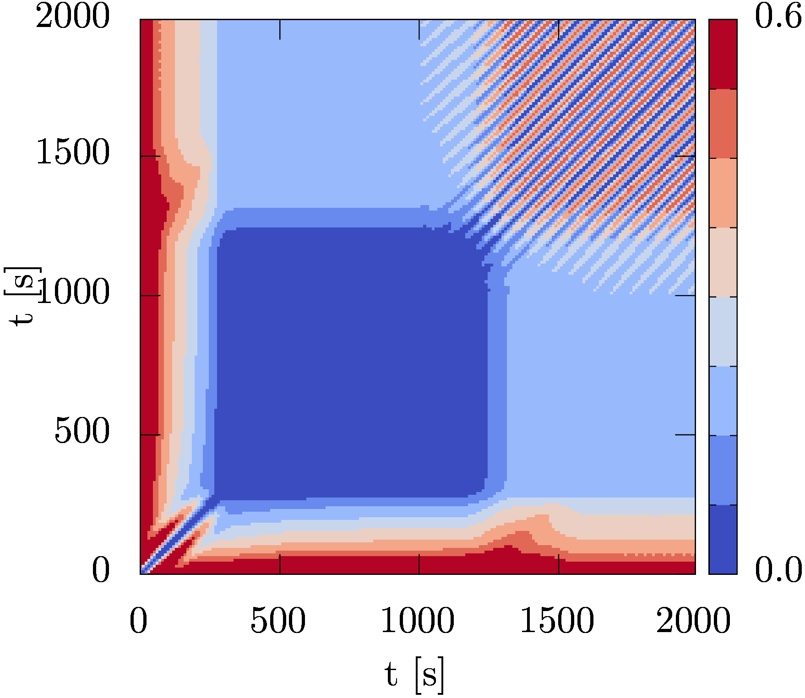
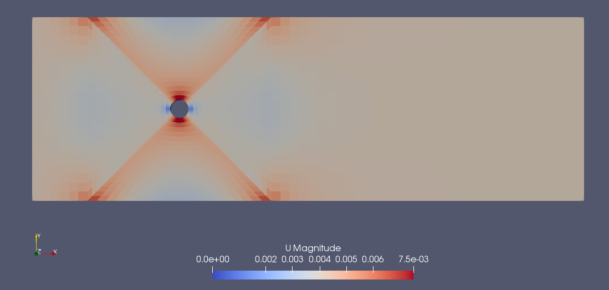
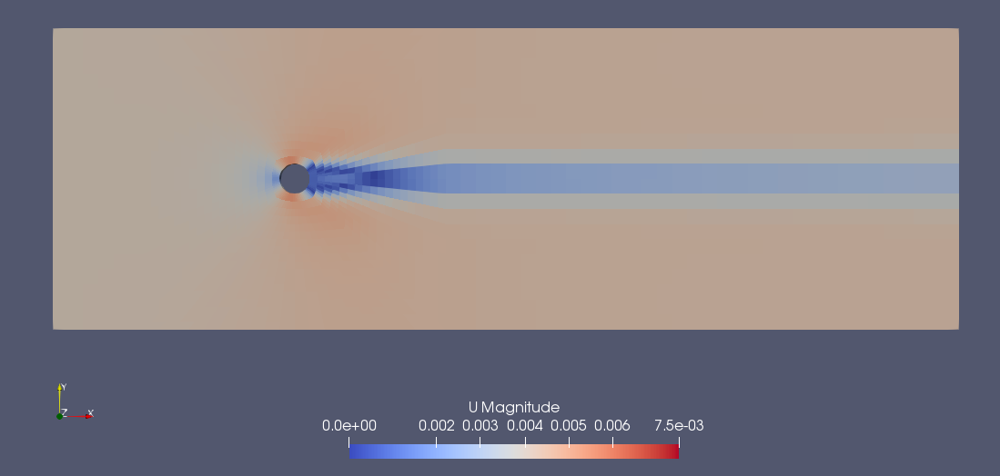
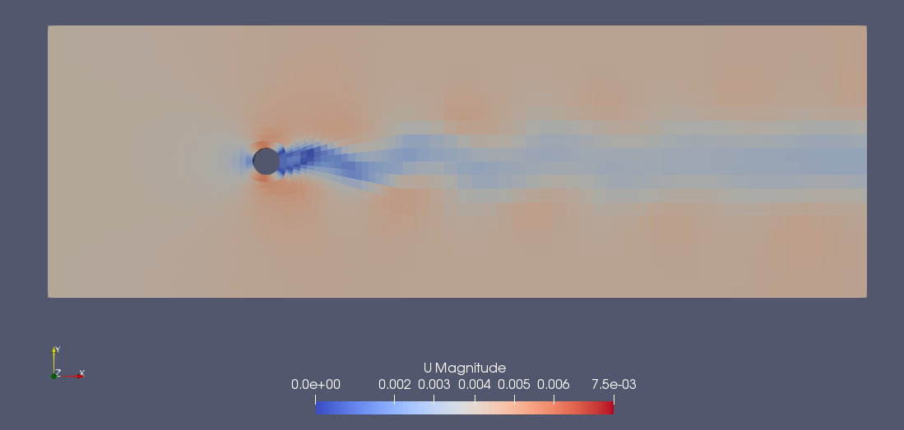
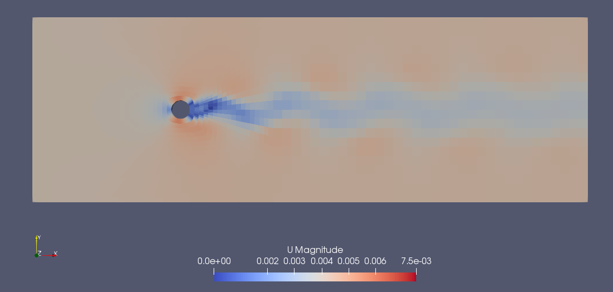
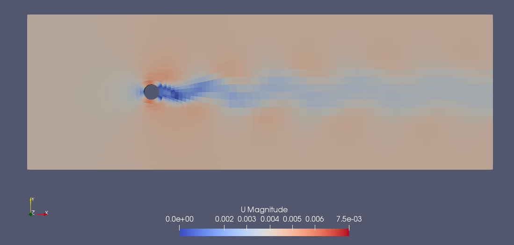

# Laminar flow over cylinder - recurrent flow

This OpenFOAM case demonstrates the recurring flow patterns of vortex sheding
of a cylinder in laminar cross flow. Apart from judging the recurrence using
the eyeball norm, i.e. by looking at the solution, we are computing the
recurrence matrix from the computed time steps.

The recurrence plot [1], a graphical representation of the recurrence matrix,
allows us to clearly distinguish between the initial phase of the solution and
the quasi steady state, which exhibits a nice periodic flow.

## Case description

The mesh is created with blockMesh using a simple blocking strategy with 6
blocks. The domain is meshed using one cell in z direction, thus the flow
simulation is a 2D simulation. The patch on the left acts as inlet, the patch
on the right is an outlet. The top and bottom patches are frictionless walls.
The cylindrical void in the domain employs wall boundary conditions.

## Results

The image below, is the recurrence plot of this simulation. The recurrence plot
is based on the recurrence matrix, which in turn was computed from the velocity
fields of this simulation.

Each entry in the recurrence matrix is computed by comparing two states of the
simulation, i.e. time steps. In this case the velocity fields of all written
time steps were compared to each other. For each entry, the magnitude of the
difference of two velocity fields was computed. This magnitude, which itself is
still a field quantity was summed up over all cell values, and finally
normalized. Consequently, the values along the main diagonal, i.e. both indices
for x and y, are zero, as the corresponding state is compared to itself.

As the simulation is initialized using *potentialFoam*, we have an initial
velocity field, which is closer to reality than a trivial initial field, i.e.
zero velocity everywhere. However, the initial velocity field is quite
unphysical as it contains artifacts due to the mesh, as shown below.
Notice, in the recurrence plot, the red bands along the x-axis for low values
of y, and along the y-axis for low values of x. This is a result of the initial
velocity field bearing no resemblance to all subsequent velocity fields.
Thus, a horizonal or vertical high-value band is the result of a state, which
does not re-occur.

Thus, a low value indicates great similarity between two time steps. E.g. the
value at (500,1000) is very low (shown in blue in the plot), which means that
the velocity fields at the time 500 s and 1000 s are very similar, as shown
below.
The whole blue square in the recurrence plot indicates a certain period in
which the solution changes very little over time. Thus, one could assume, if
the simulation were to stop aroung t = 1000 s, that the flow field in the
simulation had entered its steady state.

However, as the simulation progresses, vortex shedding kicks in, and we end up
having a nice, periodic solution. This is indicated by the narrow bands
parallel to the main diagonal in the upper right corner of the recurrence plot.
A low-value band parallel to the main diagonal means that the same sequence of
states can be observed with a certain time shift. A purely periodic system will
show the exactly same state after completing a full cycle.

The narrow bands in this recurrence plot strongly suggests that the laminar
vortex shedding exhibits periodic behaviour.

### Initial velocity field

t = 0 s

### Velocity fields at t = 500 s and t = 1000 s

The following two velocity fields are very similar to each other. In the
recurrence matrix the value for indicating the similarity of these two velocity
fields is 0.001.

t = 500 s

t = 1000 s

### Velocity fields at t = 1500 s, t = 1850 s and t = 1950 s

The following two velocity fields are very similar to each other. In the
recurrence matrix the value for indicating the similarity of these two velocity
fields is 0.047.

t = 1500 s

t = 1850 s

The following velocity field is very dissimilar to the preceeding two, although
it looks very alike. However, whereas the fields at t = 1500 s and t = 1850 s
are nearly at the same part of the cycle, these two fields and the field at
t = 1950 s are on opposite sides of the cycle. The value of the recurrence
matrix, which indicates similarity is 0.496, respectively 0.488.

t = 1950 s

### Additional notes

Apart from running the meshing tools *blockMesh* and *renumberMesh*, the solvers
*pimpleFoam* and *potentialFoam*, this case runs the tool *rStatAnalysis*, which
is part of the recurrence model.

## Post-processing

This tutorial uses a number of third party software tools for post-processing.

[Octave](https://www.gnu.org/software/octave/) is open source under the GPL and
is available for all platforms. Octave is widely compatible to MATLAB, so you
can run the post-processing script also with MATLAB.

[gnuplot](http://www.gnuplot.info/) is a portable command-line driven graphing
utility for Linux, MS Windows, OSX, and many other platforms. It is open source
under its own licence.

[TeX Live](https://www.tug.org/texlive/) is an easy way to get up and running
with the TeX document production system. It provides a comprehensive TeX system
with binaries for most flavors of Unix, including GNU/Linux, and also Windows.
It includes all the major TeX-related programs, macro packages, and fonts that
are free software, including support for many languages around the world.

[pdfCrop](https://ctan.org/pkg/pdfcrop) is part of a larger collection
[texlive-extra-utils](https://launchpad.net/ubuntu/+source/texlive-extra) of
auxiliary tools for the TeX system. This tool, however, is non essential to
the functioning of this tutorial. If it is not present or available on your
system, simply comment out the call to it.

The post-processing script has been tested with:

* GNU Octave, version 4.0.0
* gnuplot 5.0
* pdfTeX 3.14159265-2.6-1.40.16 (TeX Live 2015/Debian)
* texlive-extra-utils 2015.20160320-1

## Tested

This collection of cases has been tested with:

* OpenFOAM-5.0

## References

[1] T. Lichtenegger and S. Pirker. Recurrence CFD – A novel approach to simulate
multiphase flows with strongly separated time scales. Chemical Engineering Science,
153:394-410, 2016.
